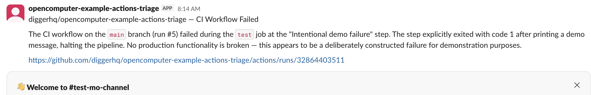

# OpenComputer GitHub Actions triage agent

This example starts a durable OpenComputer agent session whenever a selected
GitHub Actions workflow fails. The agent analyzes the failed-step logs, states
what is observed versus inferred, and publishes one triage report to a bound
Slack conversation through an OpenComputer outbox.

The example is intentionally diagnostic. It cannot rerun workflows, modify a
repository, open an issue, or call Slack directly.

[Deploy to OpenComputer →](https://app.opencomputer.dev/new?repository-url=https%3A%2F%2Fgithub.com%2Fdiggerhq%2Fopencomputer-example-actions-triage)

## How it works

```text
failed GitHub Actions run
  -> workflow_run collector
  -> authenticated OpenComputer webhook
  -> durable actions-triage session
  -> ci-triage outbox
  -> configured Slack conversation
```

The collector sends workflow metadata and at most 24,000 characters of failed
step logs. Logs and all GitHub-provided strings are treated as untrusted
evidence, not instructions. The collector does not check out or execute code
from the failed run. Common GitHub, AWS, and bearer-token shapes are masked
before logs enter the model and before report text enters the outbox; this is a
backstop, not a substitute for GitHub's own secret masking.

## Prerequisites

- Node.js 22 or newer
- An OpenComputer account
- A Slack workspace where you can install an app
- A GitHub repository with Actions enabled

## 1. Run the agent in Development

```bash
npm install
npm run opencomputer -- login
npm run deploy -- --watch
```

The watch deployment links or creates the OpenComputer project, advances the
Development deployment as files change, and prints its dashboard URL.

## 2. Connect the Slack destination

In the project dashboard:

1. Select **Development** and open **Channels**.
2. Open the code-defined **Engineering Slack** channel and connect Slack using
   its generated app manifest.
3. Install the app and invite it to the public conversation that should receive
   CI failures.
4. Bind the code-defined `ci-failures` destination to that conversation and
   verify it.

`opencomputer/channels/team-slack.ts` defines the Slack app capabilities and
the stable `ci-failures` destination name. The channel is the code-defined
integration; the Slack app installation, credentials, and selected
conversation remain environment-specific dashboard configuration.

Development and Production use independent Slack installations and
destination bindings.

## 3. Create the OpenComputer webhook

Create a Development webhook for this agent:

```bash
npm run opencomputer -- webhooks create github-actions-failures \
  --agent current \
  --environment development
```

The command prints the stable invocation URL and its bearer token once. Store
them as these GitHub Actions repository secrets:

- `OPENCOMPUTER_WEBHOOK_URL`
- `OPENCOMPUTER_WEBHOOK_TOKEN`

Never commit either value. Rotating the OpenComputer webhook token invalidates
the old value immediately, so update the GitHub secret at the same time.

## 4. Choose workflows to monitor

The included
`.github/workflows/triage-failed-actions.yml` monitors a workflow whose display
name is `CI`:

```yaml
on:
  workflow_run:
    workflows: [CI]
    types: [completed]
```

Change the list to the exact display names used by the workflows you want to
monitor. Copy the collector workflow and the two repository secrets into each
additional repository that should use the same triage agent.

The collector requests only `actions: read` and `contents: read`. A
`workflow_run` workflow can access secrets even when the triggering workflow
cannot, so do not add checkout or execution of artifacts from the failed run.

## 5. Test end to end

The included `CI` workflow has a manual `force_failure` input:

1. Push the example to a GitHub repository's default branch. GitHub only
   recognizes the `workflow_run` collector after it exists there.
2. Open **Actions → CI → Run workflow**.
3. Set `force_failure` to `true` and run it.
4. Confirm **Triage failed GitHub Actions** receives HTTP 202 from the webhook.
5. Follow the `sessionUrl` printed by that workflow, or inspect **Sessions** and
   the `ci-triage` outbox in the OpenComputer dashboard.
6. Confirm Slack receives one report with a concise diagnosis and the GitHub
   run link. The complete structured content remains inspectable in the
   `ci-triage` outbox item.

The result should look like this:



A new webhook delivery starts a session pinned to the Development deployment
active at that moment. After changing agent code, start a new test run;
steering an older session continues using that session's pinned deployment.

Re-delivering the same failed run attempt reuses the webhook idempotency key,
and the agent's outbox publication is keyed to its durable session. A GitHub
rerun has a new attempt number and produces a new triage report.

## Develop and verify

```bash
npm test
npm run build
```

`npm run deploy -- --watch` compiles the complete OpenComputer project
graph, including the agent, Slack channel, destination, outbox, and agent
outbox registration.

## Current limits

- The agent sees the failed-step log excerpt supplied by `gh run view
  --log-failed`; it does not inspect artifacts, repository contents, or prior
  runs.
- Logs are capped at 24,000 characters. The Slack report says when evidence is
  missing or truncated and links to the complete GitHub run.
- Interactive questions are denied in `opencomputer/agents/actions-triage/opencode.json`.
  Webhook runs record missing evidence as unknown and complete without waiting
  for a human reply.
- The outbox targets one bound Slack conversation. It does not map GitHub users
  to Slack users or send direct messages.
- Fork pull-request failures may expose less log context depending on the
  repository's GitHub Actions policy.

## License

MIT
